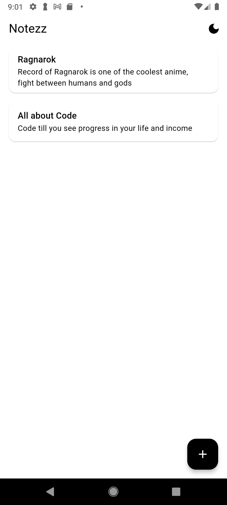
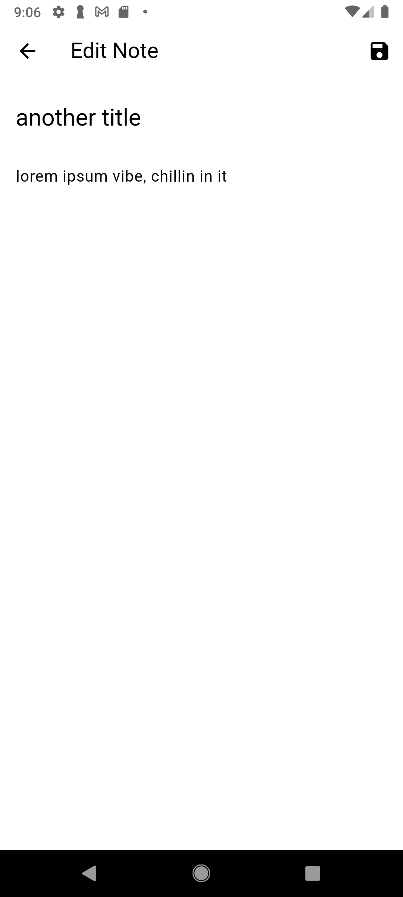
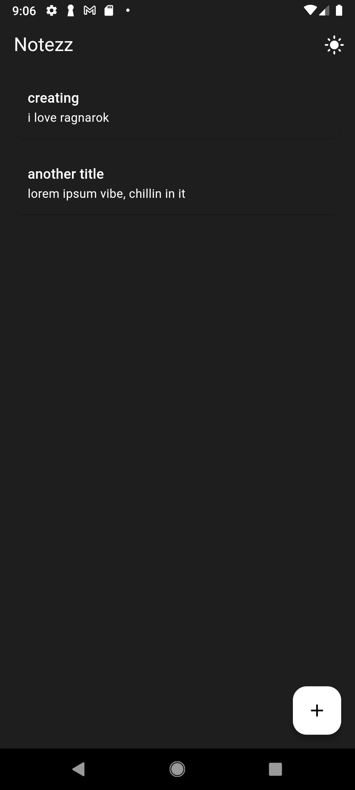

# 📝 Notezz - A Simple Note Taking App

Notezz is a clean, note-taking application built with Flutter. It allows users to create, edit, and delete notes with a beautiful, responsive UI that works on mobile platform

## ✨ Features

- **Create, Edit, Delete** notes with ease
- **Swipe-to-delete** functionality
- **Dark/Light theme** support with system preference
- **Persistent storage** using SharedPreferences
- **Clean architecture** with Riverpod for state management
- **Responsive design** that works on mobile and web

## 🛠️ Built With

- **Flutter** - Beautiful native apps in record time
- **Riverpod** - A simple way to access state from anywhere
- **Shared Preferences** - Local data persistence
- **Flutter Slidable** - Swipe actions for list items
- **UUID** - For generating unique note IDs

## 📱 Screenshots

| Light Theme | Dark Theme | Note Editor |
|-------------|------------|-------------|
|  |  |  |

## 🚀 Getting Started

### Prerequisites

- Flutter SDK (latest stable version)
- Dart SDK (included with Flutter)
- Android Studio / VS Code with Flutter plugin
- Android Emulator or physical device

### Installation

1. Clone the repository
   ```bash
   git clone https://github.com/FuturetheCoder/notezz.git
   cd notezz
   ```

2. Install dependencies
   ```bash
   flutter pub get
   ```

3. Run the app
   ```bash
   flutter run
   ```

## 🏗️ Project Structure

```
lib/
├── src/
│   ├── core/
│   │   ├── theme/
│   │      ├── app_theme.dart
│   │      └── theme_provider.dart
│   │   
│   └── features/
│       └── notes/
│           ├── data/
│           │   └── note_repository.dart
│           ├── domain/
│           │   └── note.dart
│           └── presentation/
│               ├── note_provider.dart
│               ├── screens/
│               │   ├── notes_list_screen.dart
│               │   └── note_editor_screen.dart
│               └── widgets/
│                   └── note_item.dart
├── app.dart
└── main.dart
```
